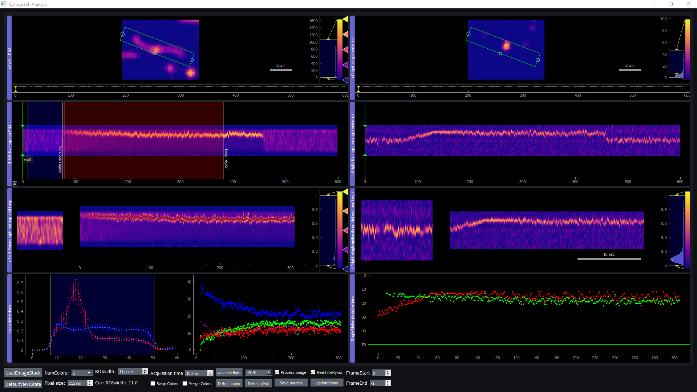

# Loop extrusion assay by DNA and SMC (LEADS)

Single-molecule assay for DNA loop extrusion by SMC. Kymograph and kinetics from the loop assays.

## Project Details




## Installation

It's best to use an isolated environment for this program. But it might just work with your standard/base environment if it has python>=3.7.

You can create an environment in conda by running the following line in a terminal

```sh
conda create -n leads-env python=3.7
```

Then activate the environment by

```sh
conda activate leads-env
```

You can install the LEADS module by dowloading this [repo](https://github.com/biswajitSM/LEADS/archive/master.zip). Go to the folder containing setup file in terminal and install by the following command.

```sh
python setup.py install
```

To save videos, install [ffmpeg](https://ffmpeg.org/download.html) and make sure you added it to your path (you can follow this [link](https://www.wikihow.com/Install-FFmpeg-on-Windows))

## Usage

To open the gui of kymograph analysis from a terminal
> python -m leads.gui.kymograph_gui

To open the gui for cropping large files in a folder
> python -m leads.gui.crop_images_gui

## Contributing

Please use issues to post your bugs and send pull requests to merge your modifications/improvemnts.

All the contributors will be acknowledged here and will be included if this ends up in a ppublication.

## Authors & Contributors

List of contributors:

- Biswajit Pradhan (biswajitp145_at_gmail.com)
- Roman Barth
