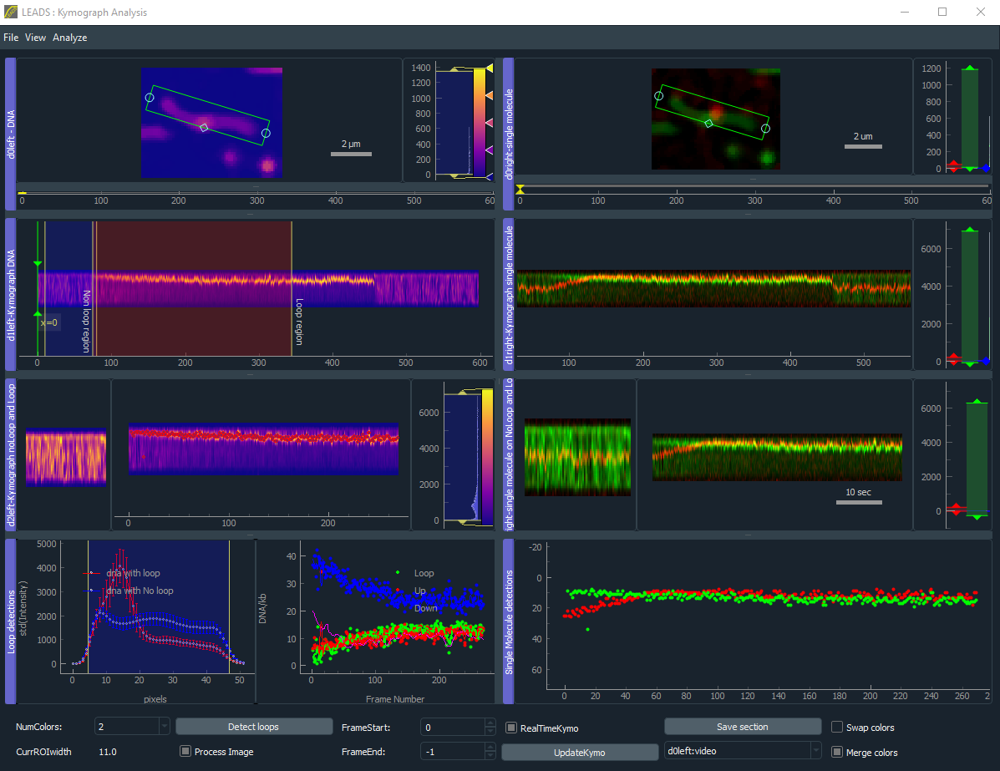

# Loop extrusion assay by DNA and SMC (LEADS)

Single-molecule assay for DNA loop extrusion by SMC. Kymograph and kinetics from the loop assays.

## Project Details




## Installation

It's best to use an isolated environment for this program. But it might just work with your standard/base environment if it has python>=3.7.

You can install the LEADS module by dowloading this [repo](https://github.com/biswajitSM/LEADS/archive/master.zip). Go to the folder containing setup.py in terminal and install by the following command.

```sh
python setup.py install
```

To save videos, install [ffmpeg](https://ffmpeg.org/download.html) and make sure you added it to your path (usable from the command line)

## Usage

To open the gui of kymograph analysis
> python -m leads.gui.kymograph_gui

To open the gui for cropping large files in a folder
> python -m leads.gui.crop_images_gui

## Contributing

Please use issues to post your bugs and send pull requests to merge your modifications/improvemnts.

All the contributors will be acknowledged here and will be included if this ends up in a ppublication.

## Authors & Contributors

List of contributors:

- Biswajit Pradhan (biswajitp145_at_gmail.com)